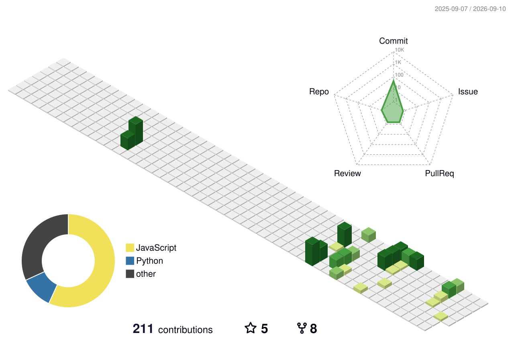
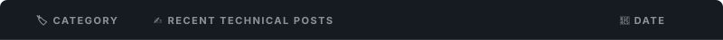
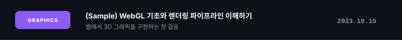
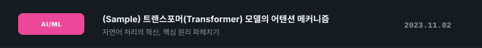
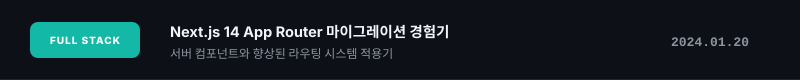
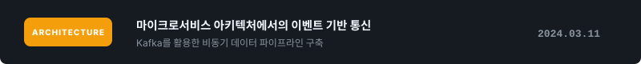
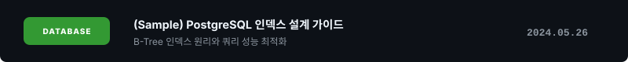

<!-- Top Banner -->

  

  
  
  
  

 

<!-- 3D Contribution Graph (Full Width) -->

  

 

<!-- GitHub Stats & Streak (Two Columns Borderless Grid) -->

  
  &nbsp;
  

 

<!-- Unified Core Expertise & Tech Stack -->
## 💼 분야별 역량 및 프로젝트 (Expertise & Tech Stack)

### ⚙️ Common Tools & Infrastructure
* **Tools**
  

    
  

---

### 🌐 Full-Stack Development
*   **Tech Stack**
    

      
    

*   **Core Project**
    *   **[Sample Web SaaS](https://github.com/Hamm-JH/sample-web)**: 실시간 협업 화이트보드 툴 구축 (React, Node.js, WebSocket)
        > 💡 *상세 아키텍처 구조도 및 라이브 데모 웹사이트 링크는 해당 레포지토리의 README에 작성되어 있습니다.*

---

### 🧠 AI / Data Science
*   **Tech Stack**
    

      
    

*   **Core Project**
    *   **[Sample Vision Model](https://github.com/Hamm-JH/sample-vision)**: 실시간 객체 인식 및 세그멘테이션 모델 경량화 (PyTorch, TensorRT)
        > 💡 *학습 파이프라인, 데이터셋 명세 및 Hugging Face 데모 링크는 해당 레포지토리의 README에 작성되어 있습니다.*

---

### 🎨 Computer Graphics
*   **Tech Stack**
    

      
    

*   **Core Project**
    *   **[Sample WebGL Engine](https://github.com/Hamm-JH/sample-graphics)**: 브라우저 기반 3D 렌더링 엔진 구현 및 최적화 (C++, WebAssembly, WebGL)
        > 💡 *렌더링 파이프라인 분석 결과, 셰이더 코드 및 성능 벤치마크 지표는 해당 레포지토리의 README에 작성되어 있습니다.*

 

<!-- Profile Customization Elements -->
## 🌟 깃허브 프로필 커스터마이징 샘플 (Profile Customizations)

<!-- 1. Pinned Repositories -->
<!-- ### 📌 레포지토리 핀(Pin) 기능 (안내)
> 💡 **참고:** 핀 기능은 README.md 파일 내부가 아닌, **깃허브 프로필 메인 페이지 설정(Customize your pins)**에서 적용합니다. 
> 최대 6개의 레포지토리를 선택하여 상단에 고정할 수 있으며, 각 레포지토리 설정(Settings)에서 `Social Preview` 이미지를 예쁘게 등록하면 핀 고정 시 시각적인 카드로 표시됩니다. -->

<!-- 2. GitHub Stats & Streak -->
<!-- ### 📊 동적 GitHub Stats 및 Streak (안내)
> 💡 **참고:** 실시간 연동되는 GitHub Stats 카드와 Streak 카드는 가독성을 위해 **프로필 상단(연락처 아래)**에 배치해 두었습니다. 테마나 설정을 바꿀 때 쿼리 매개변수를 통해 자유롭게 커스텀할 수 있습니다. -->

<!-- 3. 3D Contribution Graph -->
<!-- ### 🏙️ 3D Contribution Graph (안내)
> 💡 **참고:** 3D 기여도 그래프는 첫인상을 강조하기 위해 **프로필 상단(연락처 바로 아래)**에 한 행 전체 크기(`width="100%"`)로 배치해 두었습니다. 매일 밤 12시 깃허브 액션을 통해 자동으로 갱신됩니다. -->

<!-- 4. Real-time Activity / Blog Posts -->
### 📝 실시간 활동 및 블로그 글 연동
> 💡 **참고:** [blog-post-workflow](https://github.com/gautamkrishnar/blog-post-workflow) 같은 깃허브 액션을 설정하면, 아래 지정된 영역에 RSS 피드의 최신 글 목록이 자동으로 업데이트 됩니다.

<!-- 

  

 -->

<!--  -->

<!-- blog starts -->

   
   
   
   
   
  

<!-- blog ends -->

<!-- 5. GitHub Profile Trophy -->
### 🏆 GitHub Profile Trophy (업적 트로피)
*(활동량에 따라 자동으로 등급별 트로피가 실시간으로 수집됩니다.)*

  

 

<!-- 6. Achievements -->
### 🏆 Achievements (업적 배지 안내)
> 💡 **참고:** 깃허브 공식 업적 배지(Pull Shark, Arctic Code Vault, Yolo 등)는 README.md 내부에 텍스트로 넣는 것이 아닙니다. 
> 프로필 페이지 좌측 사이드바(프로필 사진 아래)의 **Achievements** 섹션에 자동으로 표시됩니다. 프로필 세팅(Profile Settings)에서 해당 섹션의 표시 여부를 켜고 끌 수 있습니다.
